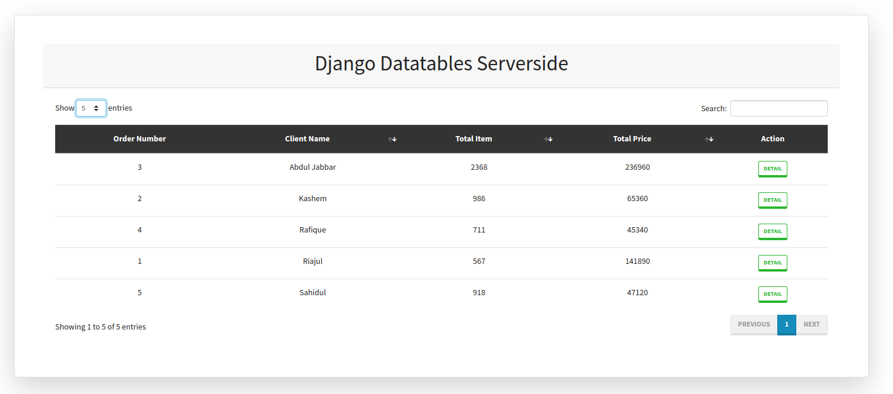
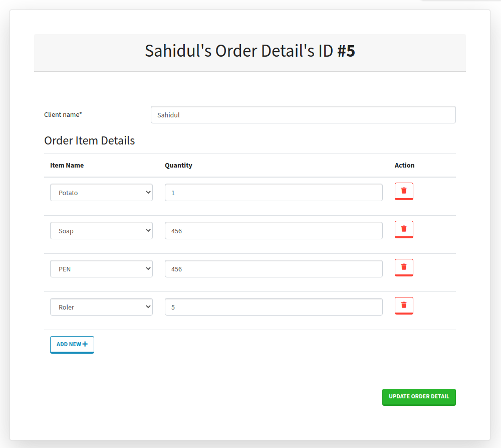

# Django Datatables Serverside

[](https://python.org)
[](https://djangoproject.com)

This is an example project to Django Datatables Server side **pagination, ordering and search** enabled




## Running the Project Locally

First, clone the repository to your local machine:

```bash
git clone https://github.com/RiajulKashem/sapience-trio.git
```

Copy .env.example to .env

```bash
cp .env.example app_root/.env
```

Build docker images

```bash
docker-compose build
```

Start services

```bash
docker-compose up -d
```